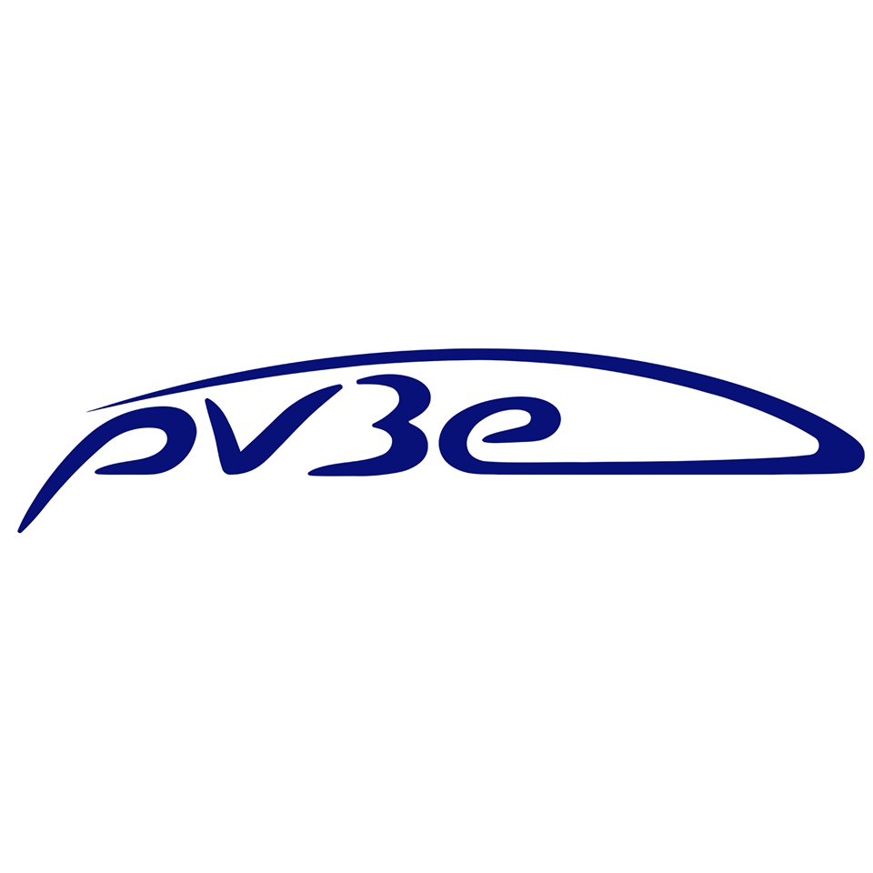

<p align="center">
  <a href="https://siera-estaca.com/">
    
  </a>
  <a href="https://pv3e-sqy.com/">
    
  </a>  
</p>

# Embedded-Systems (PV3e)

The main repository for PV3e's embedded systems, PV3e's branch.


 ```
Embedded-Systems
├── Arduino
│   ├── ESC-calibration
│   │   └── ESC-calibration.ino
│   ├── frottements
│   │   └── frottements.ino
│   └── frottements.m
├── BBB
│   ├── calibration
│   │   └── imu
│   │       ├── calibrate_accel.js
│   │       ├── calibrate_gyro.js
│   │       ├── calibrate_mag.js
│   │       └── demo.js
│   ├── can
│   │   └── an400_revC.kcd
│   ├── CAN.js
│   ├── computations.py
│   ├── GPS.py
│   ├── imu.js
│   ├── install.sh
│   ├── Nextion.py
│   ├── package.json
│   ├── PORTNAMES.py
│   ├── __pycache__
│   ├── requirements.txt
│   ├── sd_logger.py
│   ├── server_utils.py
│   ├── start.sh
│   └── telemetry.py
├── CONTRIBUTORS.md
├── DataAnalysis
│   ├── css
│   │   └── materialize.min.css
│   ├── index.html
│   ├── js
│   │   ├── init.js
│   │   ├── jQuery.min.js
│   │   ├── kalman.js
│   │   ├── materialize.min.js
│   │   ├── plotly.min.js
│   │   └── shell_values.js
│   └── res
│       ├── pv3e.png
│       └── s_logo.svg
├── index.html
├── LoRa
│   └── E32-TTL-100
│       ├── datasheet
│       │   ├── E32-TTL-100_Datasheet_CN_v5.0.pdf
│       │   └── E32-TTL-100_Datasheet_EN_v1.0.pdf
│       ├── E32-TTL-100.h
│       ├── E32-TTL-100.ino
│       ├── LICENSE
│       ├── Module.jpg
│       ├── README.md
│       └── Release
│           └── makefile
├── Nextion
│   └── PV3e_Instrumentation_portrait.HMI
├── README.md
├── Ressources
│   ├── plotter_edited.gif
│   ├── pv3e.png
│   └── s_logo.svg
└── SerialPlotter
    ├── css
    │   └── materialize.min.css
    ├── index.css
    ├── index.html
    ├── js
    │   ├── materialize.min.js
    │   └── plotly-latest.min.js
    ├── main.js
    ├── package.json
    ├── package-lock.json
    ├── README.md
    ├── renderer.js
    ├── res
    └── window.js
 ```

* **Arduino**: Arduino stuff,
* **BBB**: files to put on BeagleBone Blue,
* **Nextion**: Nextion ressources to flash,
* **Ressources**: Place for images, videos.  
* **SerialPlotter**: Computer side telemtry live viewer

## Requirements

By cloning the *BBB.git* you should be able to install all dependencies by entering:

```bash
sh install.sh
```

### Hardware

* A 4.3" Nextion screen  
* A BeagleBone Blue
* Serial GPS (Neo 6M for instance)
* Serial telemetry (3DR v2 or E32-TTL-100)

### Software

* python 2.7+ I think we must upgrade to 3.5+ (see below)
* nodejs
* Cloud9 IDE (optional, but simpler to begin with)

Python 2.7 will reach its end of life on the **1th of January 2020**. Its means : no support and no more development.

**Python dependencies**
Install them with this command :

```bash
sudo pip install -U -r requirements.txt
```

If their installations fail please get the precompiled package for you distribution as listed below :

* pynmea2 : *no package*
* pyserial: `sudo apt install python-serial`
* Naked: *no package* but important dependency : `sudo apt install python-pyyaml`
* numpy: `sudo apt install numpy`

**Node JS**
Install them with this command :

```bash
npm install
```

## Quick start

Check on [wiki](https://github.com/raymas/Embedded-Systems/wiki/BeagleBone-Blue-:-Getting-Started).
